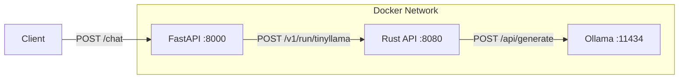

# Ollama FastAPI Rust Chat

A multi-tiered chat application demonstrating the integration of **FastAPI**, **Rust (Actix-Web)**, and **Ollama** to serve LLM requests.

## Project Architecture

This project uses a microservices architecture to process chat requests:

1.  **FastAPI (Python)**: Acts as the public-facing API gateway / frontend backend.
2.  **Rust API (Actix-Web)**: Acts as a middleware service. It implements a semaphore to strictly serialize requests (1 at a time) before forwarding them to Ollama.
3.  **Ollama**: The LLM server hosting the `tinyllama` model.



## Prerequisites

- [Docker](https://www.docker.com/)
- [Docker Compose](https://docs.docker.com/compose/)

## Getting Started

1.  **Clone the repository** (if you haven't already):
    ```bash
    git clone <repository-url>
    cd ollama-fastAPI-rust-chat
    ```

2.  **Start the services**:
    ```bash
    docker compose up --build
    ```
    *This will start all three containers. The first run may take a few minutes as it pulls the `tinyllama` model.*

3.  **Access the API**:
    The main endpoint is exposed via FastAPI on port `8000`.

## API Usage

### Chat Endpoint

**URL**: `http://localhost:8000/chat`
**Method**: `POST`

**Request Body**:
```json
{
  "prompt": "Why is the sky blue?"
}
```

**Response**:
```json
{
  "response": "The sky appears blue because of..."
}
```

**Example Request (Curl)**:
```bash
curl -X POST http://localhost:8000/chat \
     -H "Content-Type: application/json" \
     -d '{"prompt": "Why is the sky blue?"}'
```

## Component Details

### 1. FastAPI Service (`server/FastAPI`)
- **Port**: 8000
- **Framework**: FastAPI
- **Responsibility**: Validates client requests and proxies them to the Rust service.

### 2. Rust Service (`server/RUST_TAURI`)
- **Port**: 8080
- **Framework**: Actix-Web
- **Key Feature**: Implements a `Semaphore(1)` to ensure only one request is processed by the LLM at a time, preventing overload.
- **Path**: `/v1/run/tinyllama`

### 3. Ollama Service
- **Port**: 11434
- **Model**: `tinyllama` (automatically pulled on startup via `start-ollama.sh`)
- **Persistence**: Models are stored in the `ollama-data` Docker volume.

## Testing

Scripts are available in `server/testOllama/`:
- `testOllama.sh`: Sends direct requests to the Ollama instance (port 11434).
- `testConOllama.sh`: (Presumably) tests concurrent connections or connection handling.

## License

[MIT](LICENSE)
